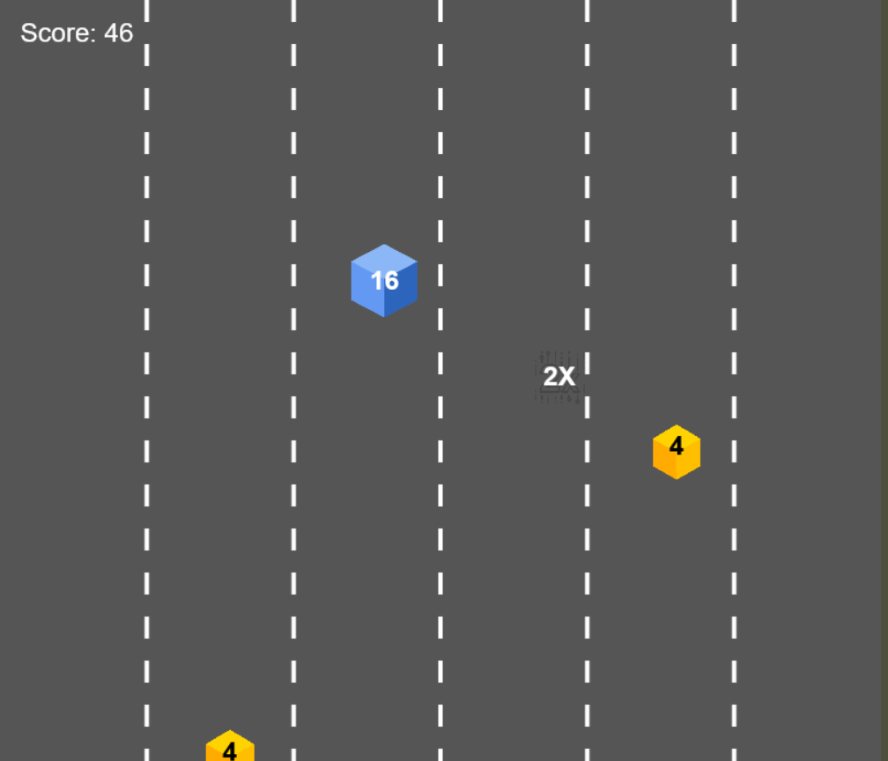

# 🏎️ Rolling Racers - 2D Sonsuz Yarış Oyunu

**Rolling Racers**, oyuncunun kontrol ettiği bir küple diğer küplerle yarıştığı, sonsuz bir 2D yarış oyunudur. Oyuncu, yol boyunca çıkan engellerden kaçmalı, güçlendiricileri toplamalı ve yüksek skor elde etmeye çalışmalıdır. Bu oyun, Rolling Racers (https://stevopineapple.itch.io/rolling-racers) oyununun temel mantığı örnek alınarak tasarlanmştır.
Oyunun nasıl oynanacağı örnek videoda (https://youtu.be/LPOFC4RCZJw) gösterilmiştir.

## 🎮 Özellikler

- Oyuncu kontrollü küp
- Sonsuz ilerleyen zemin
- Farklı türde engeller:
  - 🟫 Normal Engeller (güç karşılaştırmalı çarpışma)
  - 💣 Bombalar (anında oyun sonu)
  - ✨ Çarpan Bonusları (puanı geçici olarak ikiye katlar)
- Güçlendiriciler:
  - ⚡ Ekstra güç artışı
  - 🧲 Mıknatıs etkisi (yakın engellerden kaçınma)
- Dinamik skor sistemi
- Ses efektleri
- Arkaplan müziği

 ## Oyunun Ekran Görüntüsü
 
 

## Hedeflenen Oyun Mekaniği ve Özgün Yaklaşım
> Dikeyde ilerleyen bir engelden kaçış oyununun temel mekaniği, oyuncunun engellerle etkileşim kurabilme ve gücünü yönetebilme yeteneğiyle zenginleştirilmiştir.
Bu oyun, Rolling Racers (https://stevopineapple.itch.io/rolling-racers) oyununun temel mantığı örnek alınarak tasarlanmştır.

## Kullanılan Teknolojiler

- HTML5
- CSS3
- JavaScript 
- [Canvas API](https://developer.mozilla.org/en-US/docs/Web/API/Canvas_API)

## Projemdeki Uyarlamalar:

### Dinamik Güç Sistemi:
Oyuncunun bir güç (power) değeri bulunur. Çarpıştığı normal engellerle gücü karşılaştırılır; eğer oyuncunun gücü engelden yüksekse engeli yok eder ve gücü artar. Eğer gücü düşükse gücü azalır. Eşit güçte çarpışma ise oyunun bitmesine neden olur.
### Toplanabilir Power-Up'lar:
Yola rastgele dağılmış power-up'lar (sarı kareler) toplanarak oyuncunun gücü artırılabilir.
### Tehlikeli Bombalar:
Normal engellere ek olarak, çarpıldığında oyunu anında bitiren bombalar oyuna eklenmiştir.
### Çarpan Bonusları:
Oyuncunun gücünü iki katına çıkaran özel çarpan bonusları (2X) oyuna dinamizm katmaktadır.
### Programatik Ses Efektleri ve müzik:
Çarpışmalar, power-up toplama, bullet time ve dash gibi olaylar için Web Audio API kullanılarak özgün ses efektleri programatik olarak üretilmiştir.

## Kontroller
### Hareket:
W, A, S, D tuşları veya Yukarı, Sol, Aşağı, Sağ ok tuşları.
### Ses Kontrolü: 
Ana menüde ve oyun içinde bulunan "Ses Kapat/Aç" butonu.

## Oyun Sahnesi ve Nesneler
### Oyun Sahnesi Zenginliği: 
Dinamik olarak kayan, ortasında şerit çizgileri bulunan bir yol, oyuncunun yukarı hareketine göre değişen kamera ofseti ile sürekli hareketli bir ortam sunulmuştur. Bu durum, oyunun "sonsuz koşucu" hissini pekiştirmektedir.
### Kullanılan Nesneler:
### Oyuncu (Küp):
assets/cube.png görseliyle temsil edilen, gücü ve özel yetenekleri olan ana karakter.
### Normal Engeller: 
assets/engel.png görseliyle temsil edilen, çarpışma gücüne sahip ve farklı değerlerdeki küpler.
### Bombalar:
assets/blast.png görseliyle temsil edilen, çarpıldığında oyunu anında bitiren tehlikeli objeler.
### Çarpan Bonusları: 
assets/speed.png görseliyle temsil edilen ve üzerinde "2X" yazan, toplandığında oyuncunun gücünü iki katına çıkaran özel bonuslar.

## Tarayıcı Uyumluluğu
Bu oyun, Google Chrome ve Mozilla Firefox tarayıcılarında sorunsuz çalışacak şekilde test edilmiştir.

## Asset Kaynakları
Bu projede kullanılan ve kendime ait olmayan tüm görsel varlıkların kaynakları aşağıda belirtilmiştir:

assets/cube.png (Oyuncu Görseli), assets/engel.png (Engel Görseli), assets/blast.png (Bomba Görseli), assets/speed.png (Çarpan Bonusu Görseli): https://www.flaticon.com/
music.mp3 (Arkaplan müziği): https://uppbeat.io/music/category/game
Ses Efektleri: playSound() fonksiyonu ile Web Audio API kullanılarak programatik olarak üretilmiştir. Harici bir ses dosyası kullanılmamıştır.
